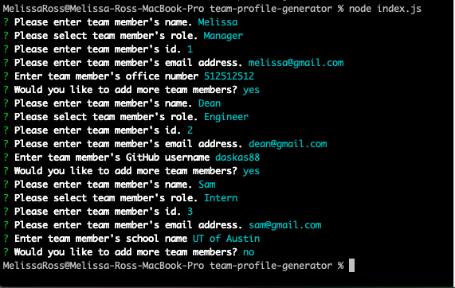
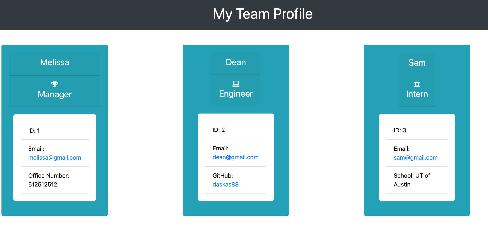
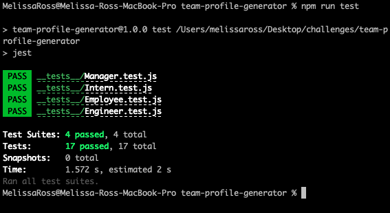

# Team Profile Generator

Follow this link that demonstrates the functionality of the Team Profile Generator! [Team Profile Generator Walkthrough Video]()

  ## Table of Contents
  
  * [Description](#description)
  * [Usage](#usage)
  * [Tests](#tests)
  * [Questions](#questions)

## Description

You can run node using the command line input application, which allows you as a Manager to generate a webpage that displays your team's information so that you can have quick access to their emails, phone numbers and GitHub profiles.

Here is a screenshot showing an example of user input in the command line: 

Here is a screen showing an example of the html webpage that generates:

## Usage
Launch terminal, run command node index, answer the questions about your team as prompted and an HTML file of your team profile will generate.

## Tests
All tests pass as shown in the screenshot below.

## Questions
If you have any questions, you can reach me by emailing [melissa.daska@gmail.com](mailto:melissa.daska@gmail.com) or follow the link to my gitHub profile [melissadaska](https://github.com/melissadaska).
